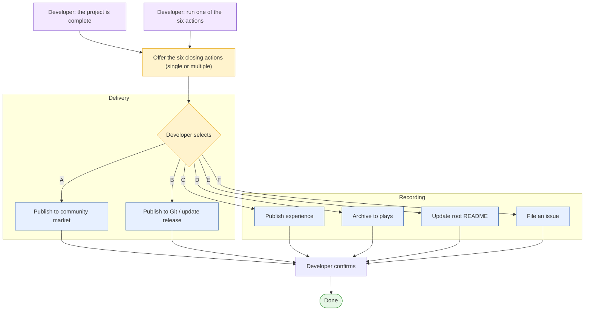

  <a href="project-completion.zh_CN.md">简体中文</a> · <strong>English</strong>

# Project Completion

When development on a project is finished, the completion flow offers a menu of
six optional closing actions. This page is the single authoritative index: it
describes the trigger, the six actions grouped by purpose, the shared safety and
consent gates, and the shared publish profile.

The completion flow is not a fixed pipeline and is not tied to a release. The
developer selects any one or a combination of the six actions, in any order. Each
action runs only after the developer confirms it.

All six actions are **optional** — none is mandatory. The README update (action
E) is one of the six; it runs when selected, and it also accompanies archiving
(action D) by default, so archiving a project also refreshes the README.

## When the completion flow is offered

Offer the six-action menu when either signal occurs:

- The developer says the project is complete (development is done).
- The developer asks to run any one of the six actions directly.

In both cases, remind the developer that the following six closing actions are
available, each selectable on its own or with others.

## The six actions

The actions are grouped by purpose. Delivery actions publish the result of the
project; recording actions capture documentation and open collaboration.

### Delivery

| ID | Action | Reference |
| --- | --- | --- |
| A | Publish to the community market | [publish-to-community.md](project-completion/publish-to-community.md) |
| B | Publish to Git and update the release | [release-update.md](project-completion/release-update.md) |

### Recording

| ID | Action | Reference |
| --- | --- | --- |
| C | Publish experience | [experience.md](project-completion/experience.md) |
| D | Archive the application to plays | [archive-plays.md](project-completion/archive-plays.md) |
| E | Update the root README | [readme-update.md](project-completion/readme-update.md) |
| F | File an issue | [file-issue.md](project-completion/file-issue.md) |

Each action points to a dedicated document in
[`project-completion/`](project-completion/) that names the repository skill or
authoritative document that drives it. The skills are not rewritten here; the
action documents reference them.

## Trigger flow

## Published profile

Publishing to the community collects a set of project attributes. Keep these as
a shared profile so actions C, D, E, and F can reuse the same values instead of
collecting them again:

- Application name (lowercase-kebab-case).
- Bilingual publish title and description.
- Cover image (`<app-name>-cover.<webp|png|jpg>`, up to 10 MiB).
- Source address: the HTTPS Git page the developer submitted, resolved from
  `git remote -v`.
- Firmware path / merged `.bin`.

At execution, reuse the profile where it was already collected. If the profile
was not collected, fetch the values through the relevant action skill.

## Post-release hardware verification

When a delivery action (A or B) produced a merged full build, verify it on real
hardware before treating the project as complete. Download the release's merged
full firmware (`FoloToy-AI-Passport-full.bin`, the flashable complete build from
`0x0`), flash it to a device, and confirm it runs normally. Do not treat a
successful build or upload as hardware validation: this step proves the artifact
the release actually points to boots and works on real hardware. The artifact
comes from the release assets (the CI/CD `full.bin`) or, for a Git release with
no CI artifact, the local `full.bin` the developer built. If it does not run,
stop and fix before closing out. See
[`CI-build-and-release.md`](CI-build-and-release.md) for the artifact and
flashing.

## Shared safety and consent gates

Every action follows the same non-negotiable rules:

- Confirm consent before starting; this work touches project-private content.
- Confirm a GitHub channel (GitHub MCP, a GitHub skill, or `gh`) before any
  submission; if none is available, generate content for manual pasting and stop.
- Do not submit (issue or PR) until the developer has reviewed and authorized it.
- Do not commit on or modify the developer's current branch; carry the change on a
  dedicated branch or worktree.
- Never include credentials, device QR secrets, private device links, personal
  data, or unsanitized logs.

## Related documents

- Firmware publishing: [publish-to-community.md](publish-to-community.md)
- Fork workflow and root README ownership: [fork-guide.md](../fork-guide.md)
- Commit and pull-request rules: [commit-and-pr.md](../contribution/commit-and-pr.md)
