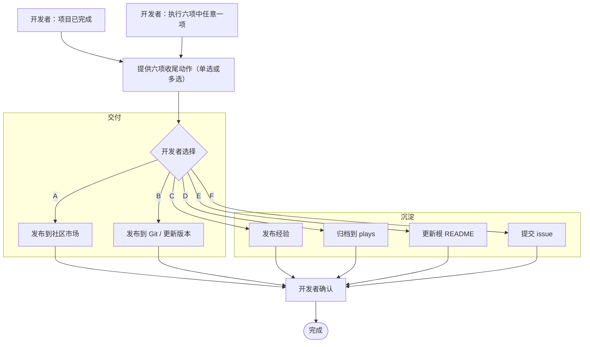

  <strong>简体中文</strong> · <a href="project-completion.md">English</a>

# 项目开发完成流程

当一个项目的开发结束，项目完成流程提供了一个由六项可选动作组成的菜单。本页是唯一权威索引：说明触发时机、按用途分组的六项动作、共同的安全与同意门槛，以及共享的发布属性。

完成流程不是固定流水线，也不与发布绑定。开发者选择其中任意一项或多项，顺序不限。每项动作只有在开发者确认后才会执行。

六项动作**全部可选**——没有任何一项是强制的。README 更新（动作 E）是六项之一，选中时执行；它也默认伴随归档（动作 D）一起进行，因此归档项目时会顺带刷新 README。

## 何时提供完成流程

出现以下任一信号时，就提供这片选项菜单：

- 开发者说项目已完成（开发结束）。
- 开发者要求直接执行这六项动作中的任意一项。

两种情况下都提醒开发者：下面六项收尾动作可用，每项都可单独选择或组合选择。

## 六项动作

动作用途分组。交付类动作发布项目结果；沉淀类动作捕获文档与开放协作。

### 交付

| 编号 | 动作 | 参考 |
| --- | --- | --- |
| A | 发布到社区市场 | [publish-to-community.md](project-completion/publish-to-community.md) |
| B | 发布到 Git 并更新版本 | [release-update.md](project-completion/release-update.md) |

### 沉淀

| 编号 | 动作 | 参考 |
| --- | --- | --- |
| C | 发布经验 | [experience.md](project-completion/experience.md) |
| D | 归档应用到 plays | [archive-plays.md](project-completion/archive-plays.md) |
| E | 更新根 README | [readme-update.md](project-completion/readme-update.md) |
| F | 提交 issue | [file-issue.md](project-completion/file-issue.md) |

每个动作都指向 [`project-completion/`](project-completion/) 下的一份专门文档，文档写明驱动它的仓库 skill 或权威文档。这里不重写 skill；动作文档引用它们。

## 触发流程

## 共享发布属性

发布到社区时会采集一组项目属性。把这些作为共享 profile，让 C、D、E、F 都能复用同一份值，而不是重复采集：

- 应用名（lowercase-kebab-case）。
- 双语发布标题与简介。
- 封面图像（`<app-name>-cover.<webp|png|jpg>`，≤10 MiB）。
- 源码地址：开发者提交的 HTTPS Git 页，从 `git remote -v` 解析。
- 固件路径 / 合并 `.bin`。

执行时若 profile 已采集则直接复用；若未采集，则通过对应动作 skill 获取这些值。

## 发布后的真机验证

当交付动作（A 或 B）产出了合并完整构建时，在把项目视为完成前先到真机验证。下载该 release 的合并完整固件（`FoloToy-AI-Passport-full.bin`，从 `0x0` 烧录的完整构建），烧录到设备并确认正常运行。不要把一次成功的构建或上传当作硬件验证：这一步证明 release 实际指向的产物能在真实硬件上启动并工作。产物来自 release 资产（CI/CD 的 `full.bin`），或对无 CI 产物的 Git release，来自开发者本地构建的 `full.bin`。若不能运行，先停下修复，再继续收口。产物与烧录见 [`CI-build-and-release.md`](CI-build-and-release.md)。

## 共同的安全与同意门槛

每项动作都遵守下面这些不可协商的规则：

- 开始前确认同意；本工作涉及项目私有内容。
- 任何提交前确认已有可用的 GitHub 通道（GitHub MCP、GitHub skill 或 `gh`）；若都不可用，则生成内容供手动粘贴并停止。
- 在开发者审查并授权之前，不提交（issue 或 PR）。
- 不在开发者当前分支上提交或修改；变更放在独立分支或 worktree 上承载。
- 永远不包含凭证、设备 QR 密钥、私密设备链接、个人数据或未脱敏日志。

## 相关文档

- 固件发布：[publish-to-community.md](publish-to-community.md)
- Fork 工作流与根 README 归属：[fork-guide.md](../fork-guide.md)
- 提交与 PR 规则：[commit-and-pr.md](../contribution/commit-and-pr.md)
